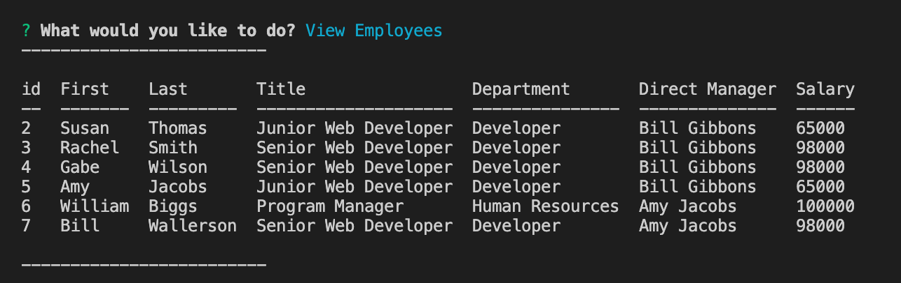

# Project: Employee Tracker 

&nbsp;

## Description:

This is a small Node JS program backed by a MySQL database, that allows a User to create and control their own employee tracking system using a command line interface (CLI) and interfacing with the database using SQL.

&nbsp;  

The User has the ability to perform the following actions:

    Display Relevant Information About:
        * Departments
        * Roles
        * Employees
    
    Add To:
        * Departments
        * Roles
        * Employees

    Remove From:
        * Departments
        * Roles
        * Employees

    Update an employee role


&nbsp;

## Technologies:

- JavaScript
- Node
- MySQL Database
- SQL Queries
- Inquirer

&nbsp;

## Usage:





&nbsp;

## Instructions:

####  How to download and play with application:

```javascript
// Clone a local copy to your machine
$> git clone https://github.com/ehoversten/.git

// Change directories into the new project
$> cd 

// Install required libraries and dependencies
$> npm install

// Create a MySQL Database on your local machine to connect to program
- Using your preferred MySQL program interface copy and paste the code from the `schema.sql` file and create the database and table schema.

- Once the database is created you can add data using the `seeds.sql` file

- You may need to configure the database connection to match your local settings, edit the values contained between the `< >` in the `server.js` file as needed.

// Database Configuration
const connection = mysql.createConnection({
    host: `<MYSQL_HOST>`,
    port: `<PORT>`,
    user: `<MYSQL_USER>`,
    password: `<MYSQL_PASS>`,
    database: 'employee_tracker'
});

- Save the `server.js` file 

// Run the server.js file
$> node server.js

```

#### Follow the prompts, use the up/down arrow keys to make selections, Enjoy!!!


&nbsp;

## Maintainer:

- Erik Hoversten

## License:

Licensed under the MIT license.
